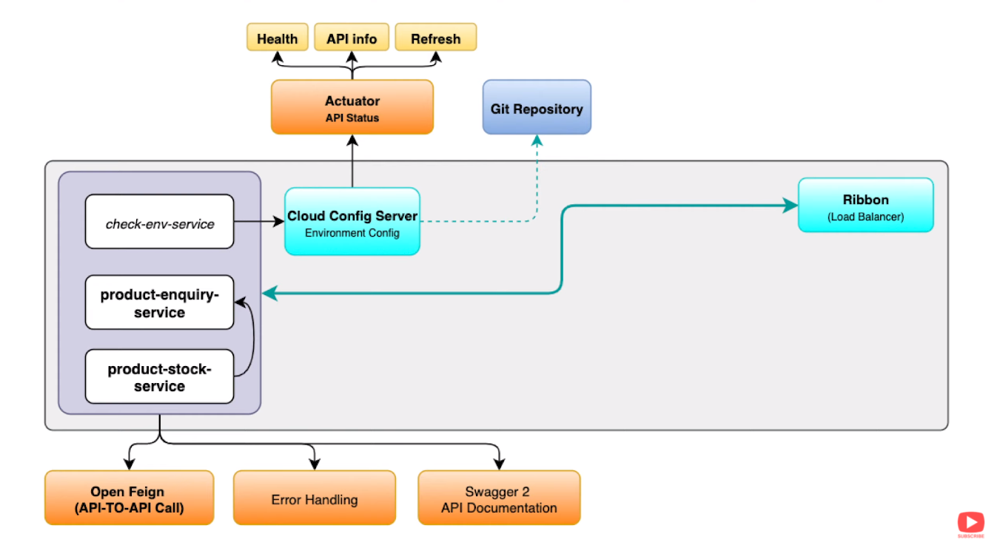
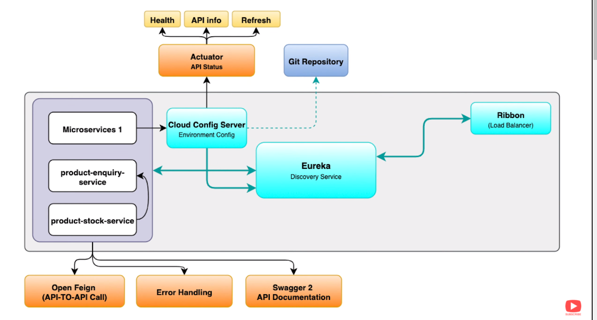
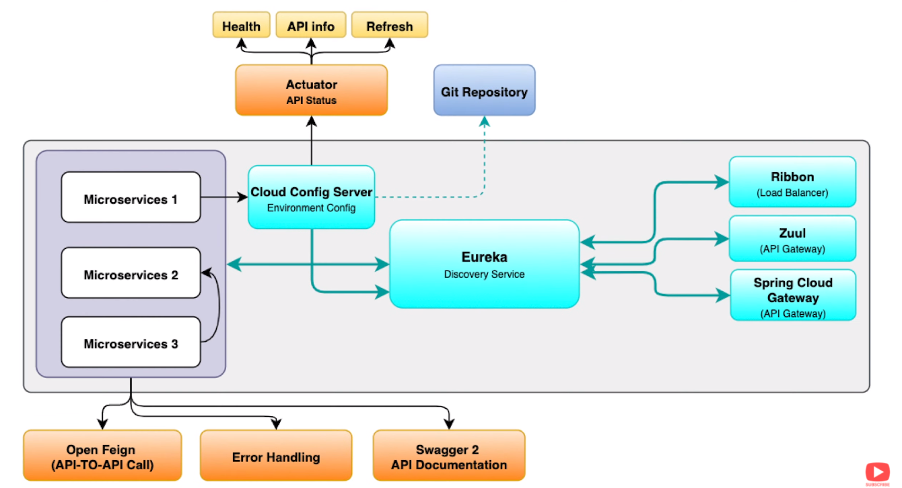
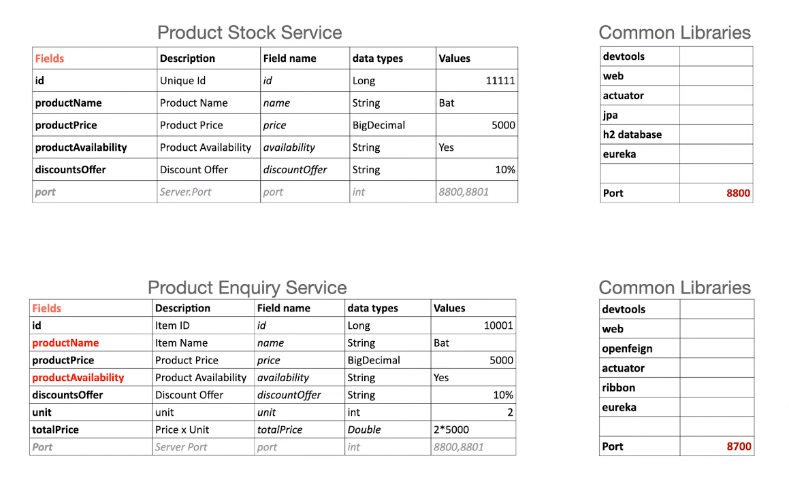

# techefx-product-stock-service

[techefx-product-stock-service](https://github.com/tokishorbankar/microservices-springboot-1.git)


### Runing Port
```
techefx-product-stock-service : 8200 8201 8202
```

#### techefx-product-stock-service



### Load Balance



### service to service communication



### Database




